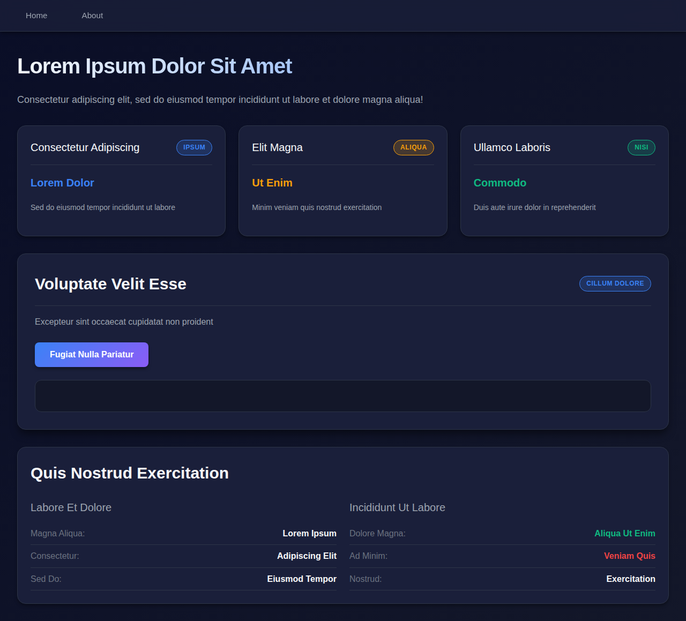
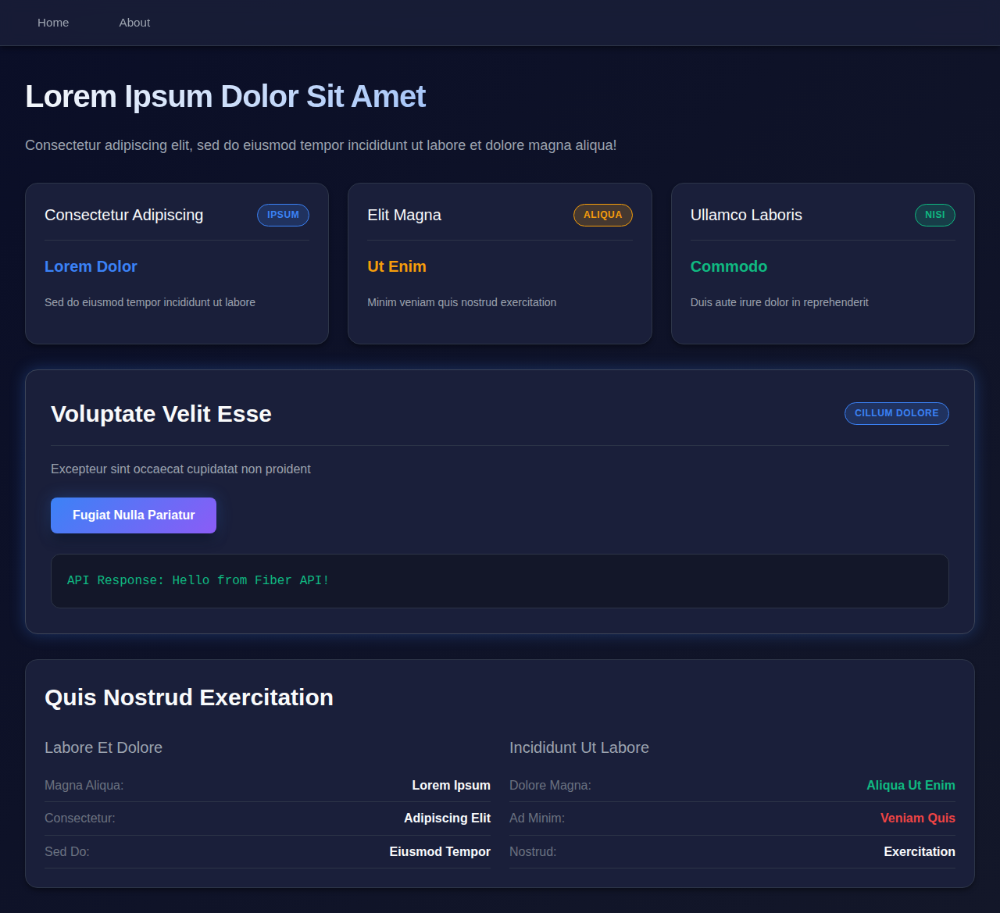
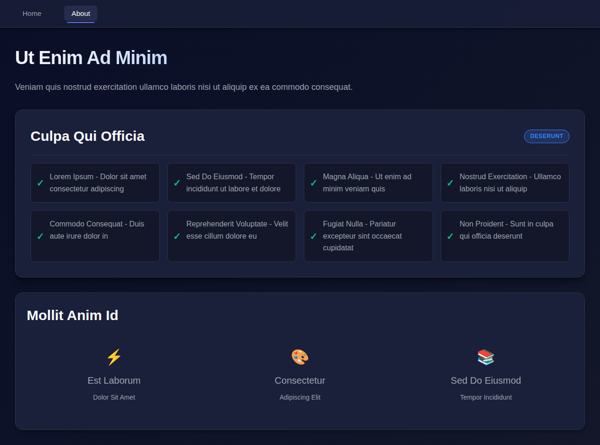
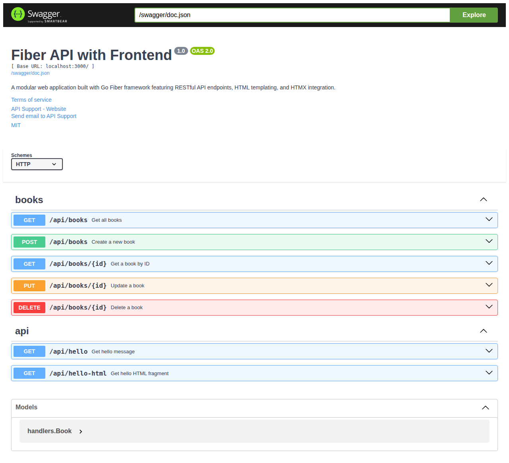
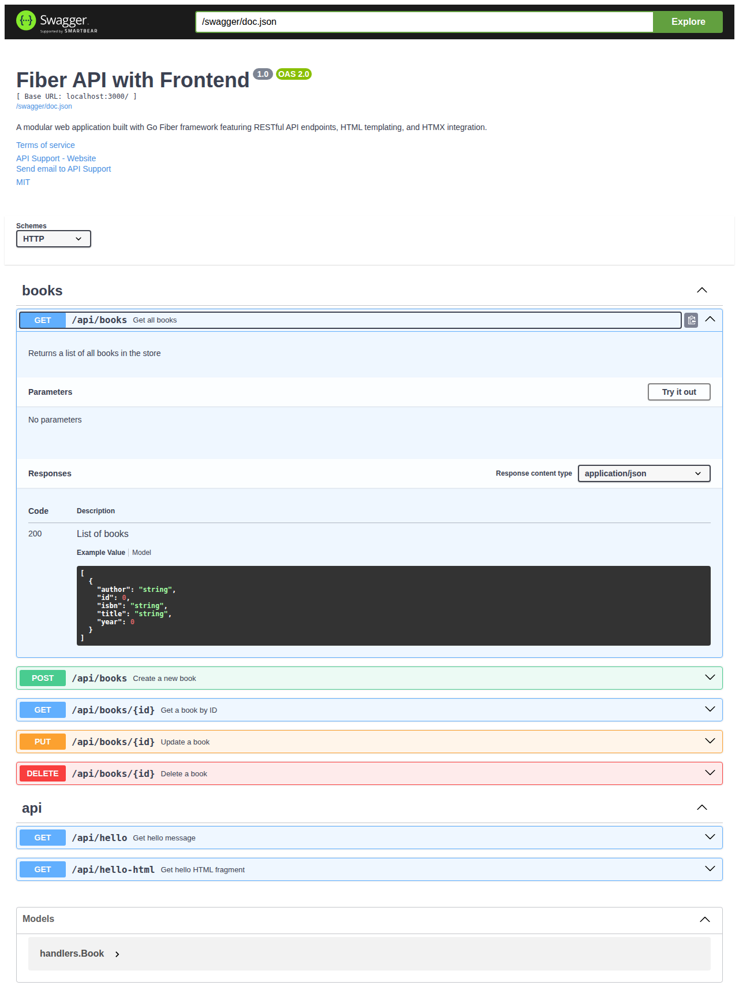

# fiber-api-with-frontend
Go Fiber API with HTML Templates and HTMX

A modular web application built with Go Fiber framework that demonstrates modern web development practices including modular architecture, HTML templating, HTMX integration, and RESTful API endpoints.

## Features

- **Go Fiber Framework**: Fast and lightweight web framework for Go
- **Modular Architecture**: Clean separation of concerns with dedicated packages
- **Database Abstraction Layer**: Repository pattern for easy database switching
- **Multiple Database Support**: 
  - In-memory storage (default, for development)
  - Google Firebase/Firestore (production-ready cloud database)
- **HTML Template Engine**: Server-side rendering with Go's HTML templates
- **HTMX Integration**: Dynamic content loading without full page reloads
- **Static File Serving**: CSS, JavaScript and other static assets
- **RESTful API Endpoints**: JSON API alongside HTML pages
- **Book Store CRUD API**: Complete example of Create, Read, Update, Delete operations
- **Swagger/OpenAPI Documentation**: Interactive API documentation with Swagger UI
- **Modern UI**: Clean, professional design with responsive layout

## Project Structure

```
.
├── main.go              # Main application entry point
├── config/              # Configuration package
│   └── config.go        # App configuration and database setup
├── repository/          # Database abstraction layer
│   ├── repository.go    # Repository interface definition
│   ├── memory.go        # In-memory implementation
│   └── firebase.go      # Firebase/Firestore implementation
├── handlers/            # HTTP handlers
│   ├── page_handlers.go # Page rendering handlers
│   └── api_handlers.go  # API endpoint handlers
├── routes/              # Route definitions
│   └── routes.go        # All application routes
├── docs/                # Swagger documentation (auto-generated)
│   ├── docs.go          # Generated Swagger docs
│   ├── swagger.json     # OpenAPI JSON specification
│   └── swagger.yaml     # OpenAPI YAML specification
├── views/               # HTML templates
│   ├── index.html       # Home page template
│   └── about.html       # About page template
├── static/              # Static assets
│   ├── css/
│   │   └── style.css    # Stylesheet
│   └── js/
│       └── htmx.min.js  # HTMX library
├── FIREBASE_SETUP.md    # Firebase setup guide
├── go.mod               # Go module file
└── go.sum               # Go dependencies
```

## Installation

1. Clone the repository:
```bash
git clone https://github.com/BryceWayne/fiber-api-with-frontend.git
cd fiber-api-with-frontend
```

2. Install dependencies:
```bash
go mod download
```

## Running the Application

### With In-Memory Database (Default)

1. Build the application:
```bash
go build -o fiber-app
```

2. Run the application:
```bash
./fiber-app
```

The server will start on `http://localhost:3000` using in-memory storage.

### With Firebase/Firestore

1. Set up Firebase by following the [Firebase Setup Guide](FIREBASE_SETUP.md)

2. Set environment variables:
```bash
export DB_TYPE=firebase
export FIREBASE_PROJECT_ID=your-project-id
export GOOGLE_APPLICATION_CREDENTIALS=/path/to/service-account-key.json
```

3. Run the application:
```bash
./fiber-app
```

The server will start on `http://localhost:3000` using Firebase/Firestore.

### Configuration Options

The application can be configured via environment variables:

- `DB_TYPE`: Database type (`memory` or `firebase`, default: `memory`)
- `FIREBASE_PROJECT_ID`: Google Cloud project ID (required for Firebase)
- `FIREBASE_COLLECTION`: Firestore collection name (default: `books`)
- `GOOGLE_APPLICATION_CREDENTIALS`: Path to service account JSON key file (required for Firebase)

## Available Routes

### Page Routes
- **GET /** - Home page with HTML template and HTMX demo
- **GET /about** - About page with feature list

### API Documentation
- **GET /swagger/*** - Interactive Swagger UI for API documentation
- **GET /swagger/doc.json** - OpenAPI JSON specification

### API Routes
- **GET /api/hello** - JSON API endpoint
- **GET /api/hello-html** - HTML fragment endpoint for HTMX

### Book Store API (CRUD Operations)
- **POST /api/books** - Create a new book
- **GET /api/books** - Get all books
- **GET /api/books/:id** - Get a specific book by ID
- **PUT /api/books/:id** - Update an existing book
- **DELETE /api/books/:id** - Delete a book

#### Book API Examples

**Create a Book:**
```bash
curl -X POST http://localhost:3000/api/books \
  -H "Content-Type: application/json" \
  -d '{
    "title": "The Go Programming Language",
    "author": "Alan Donovan and Brian Kernighan",
    "isbn": "978-0134190440",
    "year": 2015
  }'
```

**Get All Books:**
```bash
curl -X GET http://localhost:3000/api/books
```

**Get a Specific Book:**
```bash
curl -X GET http://localhost:3000/api/books/1
```

**Update a Book:**
```bash
curl -X PUT http://localhost:3000/api/books/1 \
  -H "Content-Type: application/json" \
  -d '{
    "title": "The Go Programming Language (Updated)",
    "author": "Alan Donovan and Brian Kernighan",
    "isbn": "978-0134190440",
    "year": 2015
  }'
```

**Delete a Book:**
```bash
curl -X DELETE http://localhost:3000/api/books/1
```

**Test All Endpoints:**
```bash
# Run the provided test script (make sure the server is running first)
./test_book_api.sh
```

## Architecture

### Modular Design
The application follows a modular architecture pattern:

- **config**: Handles application configuration and database setup
- **repository**: Database abstraction layer using the Repository pattern
  - Provides a clean interface for data operations
  - Allows easy switching between different database backends
  - Currently supports in-memory and Firebase/Firestore
- **handlers**: Contains HTTP request handlers organized by functionality
- **routes**: Centralized route definitions and repository initialization
- **docs**: Auto-generated Swagger/OpenAPI documentation

This structure makes the codebase more maintainable and scalable.

### Database Abstraction
The application uses the Repository pattern to abstract database operations:

```go
type BookRepository interface {
    Create(ctx context.Context, book *Book) error
    GetAll(ctx context.Context) ([]Book, error)
    GetByID(ctx context.Context, id string) (*Book, error)
    Update(ctx context.Context, id string, book *Book) error
    Delete(ctx context.Context, id string) error
}
```

This design allows you to:
- Switch databases without changing business logic
- Add new database implementations easily
- Test with mock repositories
- Use different databases for different environments

### API Documentation with Swagger
The application uses Swagger/OpenAPI for automatic API documentation:

- **Swagger Annotations**: API endpoints are documented using Swagger comments in the code
- **Auto-generation**: Documentation is generated using the `swag` tool
- **Interactive UI**: Swagger UI provides an interactive interface to explore and test the API
- **OpenAPI Specification**: Available in both JSON and YAML formats

To regenerate the Swagger documentation after making changes to API endpoints:
```bash
# Install swag CLI tool (if not already installed)
go install github.com/swaggo/swag/cmd/swag@latest

# Generate documentation
~/go/bin/swag init
```

### HTMX Integration
The frontend uses HTMX for dynamic content updates without full page reloads. The API endpoint returns HTML fragments that are swapped into the page, providing a smooth user experience.

## Screenshots

### Home Page


### HTMX in Action


### About Page


### Swagger API Documentation


### Swagger Endpoint Details


## Development

To run in development mode with auto-reload, you can use tools like `air`:

```bash
go install github.com/cosmtrek/air@latest
air
```

## Dependencies

- [Fiber v2](https://github.com/gofiber/fiber) - Web framework
- [Fiber Template HTML](https://github.com/gofiber/template) - HTML template engine
- [Fiber Swagger](https://github.com/gofiber/swagger) - Swagger middleware for Fiber
- [Swag](https://github.com/swaggo/swag) - Swagger documentation generator
- [Cloud Firestore](https://cloud.google.com/firestore) - Google Cloud Firestore client library
- [Google Cloud APIs](https://google.golang.org/api) - Google Cloud API support

## License

MIT
